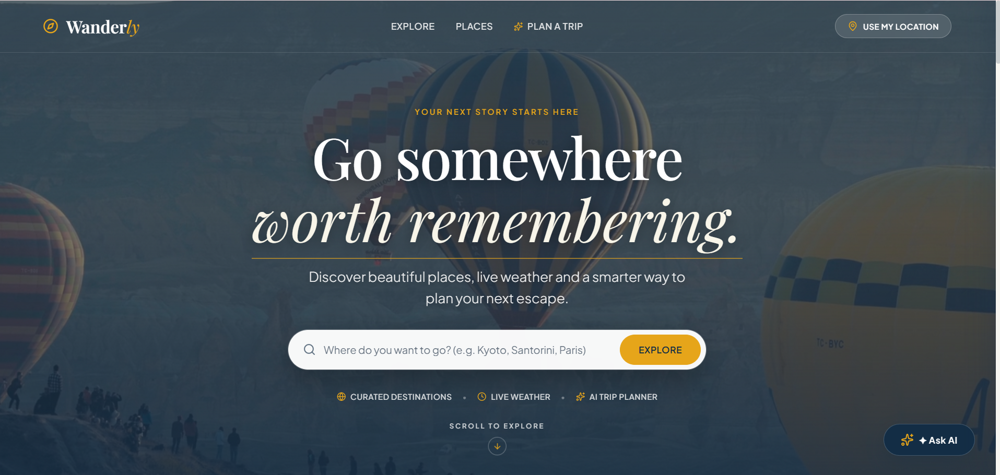
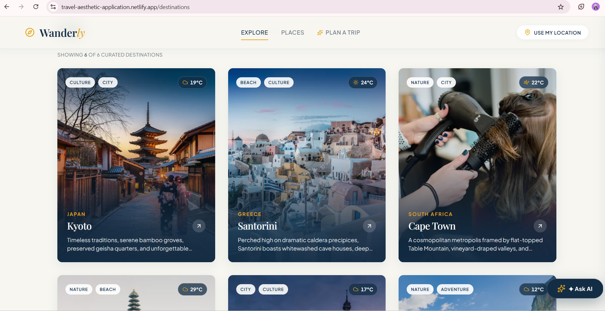
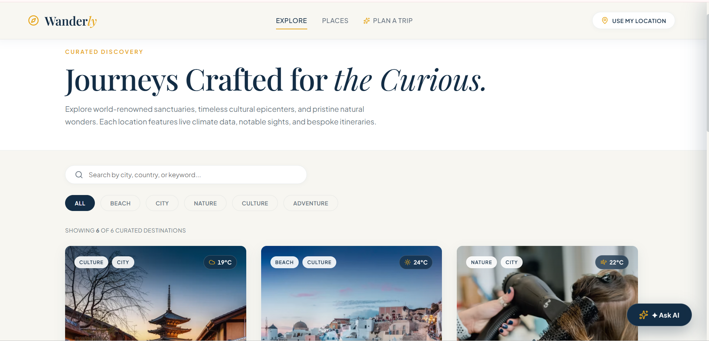
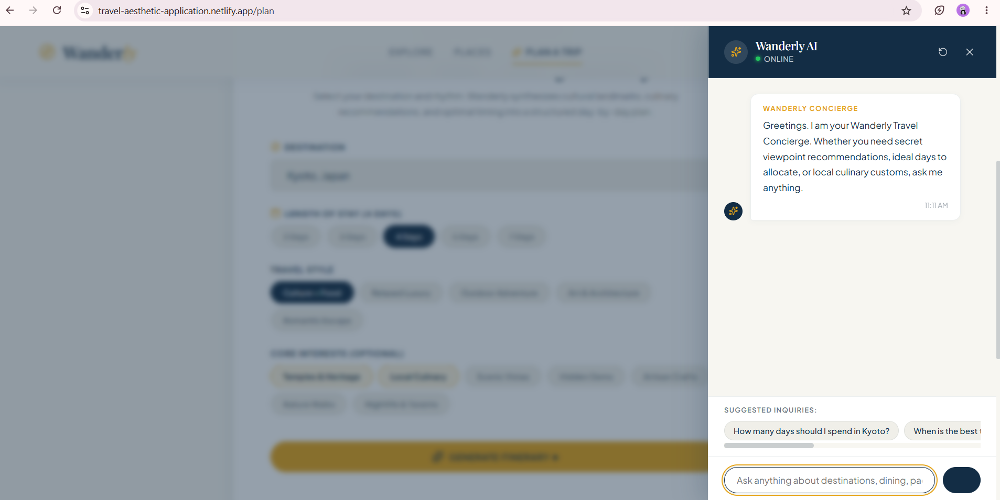
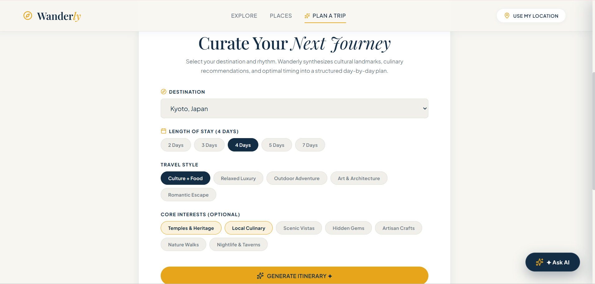

# ✈️ Wanderly

### *Go somewhere worth remembering.*

**Wanderly** is a premium, editorial-style travel discovery and intelligent trip-planning web application built with **React 19** and **Vite 6**.

Inspired by luxury travel publications such as *Kinfolk*, *Cereal*, and *Condé Nast Traveler*, Wanderly combines cinematic visuals, curated destinations, real-time weather information, browser location intelligence, and an AI-powered travel concierge to create a sophisticated travel-planning experience.

---

## ✨ Features

### 🎬 Cinematic Landing Experience

* Full-viewport travel hero section
* Aerial looping travel video
* Elegant **Playfair Display** typography
* Responsive destination search
* Smooth-scroll navigation
* Editorial-inspired visual design

### 🌍 Curated Destination Explorer

Explore carefully curated destinations including:

* 🇬🇷 Santorini
* 🇯🇵 Kyoto
* 🇿🇦 Cape Town
* 🇮🇩 Bali
* 🇫🇷 Paris
* 🇨🇭 Swiss Alps

Features include:

* Real-time keyword search
* Instant category filtering
* Categories:

  * All
  * Beach
  * City
  * Nature
  * Culture
  * Adventure
* Interactive image zoom effects
* Responsive destination grid

### 📍 Destination Details

Each destination has its own immersive detail page:

`/destination/:id`

Includes:

* Large photography header
* Cultural narratives
* Destination atmosphere tags
* Real-time weather
* Notable sights
* Local recommendations
* Responsive editorial layout

### 🏛️ Famous Places Showcase

Discover notable attractions and landmarks such as:

* Fushimi Inari Taisha
* Oia Castle
* Table Mountain
* Other destination-specific landmarks

Each place includes:

* Photography
* Visiting hours
* Neighborhood information
* Description
* Interactive favorite toggle

### 🌤️ Live Weather

Wanderly integrates the **OpenWeather API** to display atmospheric information including:

* Temperature
* Weather conditions
* Feels-like temperature
* Humidity
* Wind speed

The application also includes:

* Loading skeletons
* Error handling
* Cached seasonal fallbacks
* Offline-friendly simulated weather data

### 📍 Location Awareness

The `LocationPicker` component uses the browser's Geolocation API to:

* Detect the user's current location
* Calculate distance to curated destinations
* Display distance in kilometers
* Recommend the closest destination
* Provide manual destination search as a fallback

### 🤖 AI Travel Concierge

Wanderly includes a floating **AI Travel Concierge** powered by the Google Gemini API.

Users can ask questions such as:

* "How many days should I spend in Kyoto?"
* "What should I eat in Paris?"
* "Is Kyoto good for solo travel?"
* "What are the best places to visit in Santorini?"

Features include:

* Floating chat interface
* Suggested inquiry chips
* Conversational responses
* Conversation reset
* Graceful fallback responses when the API is unavailable

### 🗓️ Intelligent Itinerary Planner

The `/plan` page allows users to generate structured travel itineraries.

Users can configure:

* Trip duration
* Travel style
* Core interests

Supported travel styles include:

* Culture + Food
* Relaxed Luxury
* Outdoor Adventure

Generated itineraries include:

* Morning activities
* Afternoon activities
* Evening activities
* Restaurant recommendations
* Insider tips
* Day-by-day timeline
* Print/PDF export

### 📴 Resilient Offline Architecture

Wanderly is designed to remain functional even when external APIs are unavailable.

Fallback systems are provided for:

* OpenWeather
* Google Gemini
* Unsplash

This allows evaluators to explore the application's core functionality without requiring API keys.

### ♿ Accessibility & Performance

The application follows modern accessibility and performance practices:

* Semantic HTML5 elements
* Keyboard navigation
* `:focus-visible` states
* ARIA landmarks
* Escape-key listeners
* Responsive layouts
* Lightweight custom CSS
* No heavy UI component libraries

---

# 🎨 Design Philosophy

Wanderly follows a restrained, premium editorial design language inspired by luxury travel magazines.

The interface intentionally avoids generic booking templates and traditional card-heavy layouts.

Instead, the design focuses on:

* Cinematic photography
* Generous whitespace
* Editorial typography
* Subtle animations
* Elegant interactions
* Calm visual hierarchy
* Premium travel aesthetics

## 🎨 Color Palette

| Token               | Hex       | Usage                                   |
| ------------------- | --------- | --------------------------------------- |
| **Primary Dark**    | `#132D45` | Headings, navbar, active states, footer |
| **Warm Background** | `#F7F6F1` | Main editorial canvas                   |
| **Warm Accent**     | `#E6A51A` | Buttons, badges, highlights             |
| **Secondary Text**  | `#697582` | Supporting text and metadata            |
| **Pure White**      | `#FFFFFF` | Cards, modals, hero contrast            |

## ✍️ Typography

### Headings

**Playfair Display**

Used for:

* Hero headings
* Editorial titles
* Destination names
* Highlighted phrases

### Body & Controls

**Plus Jakarta Sans**

Used for:

* Paragraphs
* Navigation
* Buttons
* Forms
* Metadata

---

# 🛠️ Tech Stack

| Technology                  | Purpose                                    |
| --------------------------- | ------------------------------------------ |
| **React 19**                | Frontend framework                         |
| **Vite 6**                  | Development & build tool                   |
| **React Router DOM 7**      | Client-side routing                        |
| **JavaScript (ES6+)**       | Application logic                          |
| **Custom CSS**              | Styling & responsive design                |
| **Lucide React**            | Icons                                      |
| **Google Gemini API**       | AI travel concierge & itinerary generation |
| **OpenWeather API**         | Real-time weather                          |
| **Unsplash API/CDN**        | Travel photography                         |
| **Browser Geolocation API** | Location awareness                         |

> **Note:** Wanderly uses pure custom CSS. No Tailwind CSS or heavy UI component libraries are used.

---

# 🧩 Application Architecture

```text
User
 │
 ├── Home
 │    ├── Hero
 │    ├── Destination Search
 │    └── Featured Destinations
 │
 ├── Destinations
 │    ├── Search
 │    ├── Category Filters
 │    └── Destination Cards
 │
 ├── Destination Details
 │    ├── Destination Information
 │    ├── Weather
 │    └── Famous Places
 │
 ├── Trip Planner
 │    ├── Trip Configuration
 │    ├── Gemini AI
 │    └── Day-by-Day Itinerary
 │
 ├── Location Picker
 │    └── Browser Geolocation
 │
 └── AI Concierge
      └── Gemini API
```

---

# 📁 Folder Structure

```text
wanderly/
│
├── .env
├── .env.example
├── .gitignore
├── index.html
├── package.json
├── package-lock.json
├── vite.config.js
├── README.md
│
├── public/
│   ├── favicon.svg
│   └── videos/
│       └── travel-hero.mp4
│
└── src/
    │
    ├── App.jsx
    ├── main.jsx
    │
    ├── components/
    │   │
    │   ├── AI/
    │   │   ├── AIChat.css
    │   │   ├── AIChat.jsx
    │   │   └── ChatMessage.jsx
    │   │
    │   ├── Destination/
    │   │   ├── Destination.css
    │   │   ├── DestinationCard.jsx
    │   │   ├── DestinationGrid.jsx
    │   │   └── DestinationSearch.jsx
    │   │
    │   ├── Footer/
    │   │   ├── Footer.css
    │   │   └── Footer.jsx
    │   │
    │   ├── Hero/
    │   │   ├── Hero.css
    │   │   └── Hero.jsx
    │   │
    │   ├── Itinerary/
    │   │   ├── Itinerary.css
    │   │   ├── Itinerary.jsx
    │   │   ├── ItineraryDay.jsx
    │   │   └── ItineraryGenerator.jsx
    │   │
    │   ├── Location/
    │   │   ├── LocationPicker.css
    │   │   └── LocationPicker.jsx
    │   │
    │   ├── Navbar/
    │   │   ├── Navbar.css
    │   │   └── Navbar.jsx
    │   │
    │   ├── Places/
    │   │   ├── FamousPlace.jsx
    │   │   └── FamousPlaces.css
    │   │
    │   ├── UI/
    │   │   ├── EmptyState.jsx
    │   │   ├── ErrorState.jsx
    │   │   ├── LoadingState.jsx
    │   │   └── UIStates.css
    │   │
    │   └── Weather/
    │       ├── Weather.css
    │       └── WeatherCard.jsx
    │
    ├── data/
    │   └── destinations.js
    │
    ├── hooks/
    │   ├── useDestinations.js
    │   ├── useLocation.js
    │   └── useWeather.js
    │
    ├── pages/
    │   ├── DestinationDetails.css
    │   ├── DestinationDetails.jsx
    │   ├── Destinations.css
    │   ├── Destinations.jsx
    │   ├── Home.css
    │   ├── Home.jsx
    │   ├── PlanTrip.css
    │   └── PlanTrip.jsx
    │
    ├── services/
    │   ├── geminiService.js
    │   ├── imageService.js
    │   └── weatherService.js
    │
    ├── styles/
    │   ├── animations.css
    │   ├── global.css
    │   └── variables.css
    │
    └── utils/
        ├── formatWeather.js
        └── itineraryParser.js
```

---

# 🌐 External APIs

## 1. Google Gemini API

Used for:

* AI Travel Concierge
* Personalized travel recommendations
* Day-by-day itinerary generation

Model:

```text
gemini-1.5-flash
```

## 2. OpenWeather API

Used for:

* Current temperature
* Weather conditions
* Feels-like temperature
* Humidity
* Wind speed

## 3. Unsplash

Used for:

* Destination photography
* Famous place imagery
* Editorial travel visuals

Curated CDN images are also used as fallback sources.

---

# 🔐 Environment Variables

Create a `.env` file in the project root.

```env
# OpenWeather API
VITE_OPENWEATHER_API_KEY=your_openweather_api_key

# Google Gemini API
VITE_GEMINI_API_KEY=your_gemini_api_key

# Optional Unsplash API
VITE_UNSPLASH_ACCESS_KEY=your_unsplash_access_key
```

You can also copy the example environment file:

```bash
cp .env.example .env
```

### Important

Do **not** commit your actual `.env` file or API keys to GitHub.

Make sure `.env` is included in `.gitignore`.

---

# 🚀 Getting Started

## 1. Clone the Repository

```bash
git clone https://github.com/deeptireddy-hub/travel-aesthetic-application.git
```

## 2. Navigate to the Project

```bash
cd wanderly
```

## 3. Install Dependencies

```bash
npm install
```

## 4. Configure Environment Variables

Create a `.env` file:

```bash
VITE_OPENWEATHER_API_KEY=your_openweather_api_key
VITE_GEMINI_API_KEY=your_gemini_api_key
VITE_UNSPLASH_ACCESS_KEY=your_unsplash_access_key
```

API keys are optional because Wanderly provides built-in fallback data.

## 5. Start the Development Server

```bash
npm run dev
```

Open the URL displayed in your terminal.

Typically:

```text
http://localhost:3001
```

## 6. Build for Production

```bash
npm run build
```

The production build will be generated inside:

```text
dist/
```

## 7. Preview Production Build

```bash
npm run preview
```

---

# 📱 Responsive Design

Wanderly is designed to provide a consistent experience across mobile, tablet, desktop, and large desktop screens.

| Device            | Breakpoint        | Design                                     |
| ----------------- | ----------------- | ------------------------------------------ |
| 📱 Mobile         | `320px – 480px`   | Hamburger navigation, stacked layouts      |
| 📱 Tablet         | `768px – 1024px`  | 2-column destination grid                  |
| 💻 Desktop        | `1280px+`         | 3-column destination grid                  |
| 🖥️ Large Desktop | `1440px – 1920px` | Maximum container width & fluid typography |

### Mobile

* Collapsible hamburger navigation
* Full-width AI chat
* Stacked search forms
* Vertical famous-place sections
* Touch-friendly controls

### Tablet

* Two-column destination grid
* Adaptive weather cards
* Responsive typography

### Desktop

* Three-column destination grid
* Horizontal editorial place sections
* Slide-in AI concierge
* Large cinematic imagery

---

# 🧠 Error Handling & Fallbacks

Wanderly is designed to avoid application crashes when external services fail.

### API unavailable

The application automatically falls back to built-in data.

### Weather unavailable

Displays curated seasonal weather information.

### Gemini unavailable

Provides fallback travel recommendations and itinerary content.

### Image API unavailable

Uses curated image URLs/CDN assets.

This makes the application suitable for demonstrations and evaluations even without API configuration.

---

# 🚢 Deployment

Wanderly can be deployed easily to platforms such as:

* Vercel
* Netlify

## Netlify Deployment

1. Push the project to GitHub.
2. Open Netlify.
3. Import the GitHub repository.
4. Select **Vite** as the framework.
5. Add the required environment variables.
6. Deploy the application.

### Build Command

```bash
npm run build
```

### Publish Directory

```text
dist
```

---

# 🔮 Future Enhancements

Potential future improvements include:

* 🗺️ Interactive maps
* 🏨 Hotel recommendations
* ✈️ Flight discovery
* 💰 Trip budget planner
* 🌦️ Multi-day weather forecasts
* ❤️ Persistent favorite destinations
* 👤 User accounts
* ☁️ Cloud-saved itineraries
* 📱 Progressive Web App support
* 🌎 More destinations and travel categories

---

# 🎯 Project Goals

Wanderly was designed to demonstrate how a modern React application can combine:

* Component-based architecture
* Responsive web design
* API integration
* AI-powered functionality
* Browser APIs
* Client-side routing
* Custom CSS architecture
* Error handling
* Accessibility
* Responsive UX
* Editorial visual design

The goal is to create a travel application that feels less like a conventional booking platform and more like a **premium digital travel publication with an intelligent planning assistant**.

---

# 📸 Screenshots

### Home



### Destination Explorer



### Destination Details



### AI Travel Concierge



### Trip Planner



Recommended screenshot folder:

```text
screenshots/
├── wanderly-home.png
├── wanderly-destinations.png
├── explore-page.png
├── chat-bot.png
└── trip-planner.png
```

---

# 📄 License

This project is licensed under the **MIT License**.

Copyright © 2026 Wanderly.

---

<div align="center">

### ✈️ Wanderly

*Go somewhere worth remembering.*

Built with ❤️ using **React + Vite + Custom CSS**

</div>
